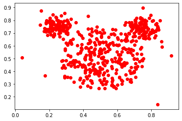
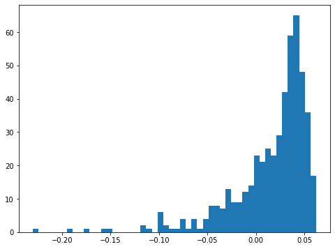
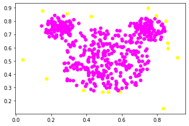
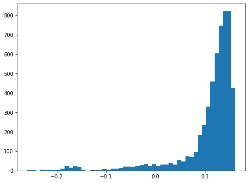

```python
import numpy as np
np.set_printoptions(threshold=10000,suppress=True)
import pandas as pd
import warnings
import matplotlib.pyplot as plt
warnings.filterwarnings('ignore')
```


```python
mouse = pd.read_csv("mouse.txt",sep=' ', header=None)
```


```python
X_mouse=Mouse.values
```


```python
plt.plot(X_mouse[:,0], X_mouse[:,1], 'ro')
plt.show
```


    <function matplotlib.pyplot.show(close=None, block=None)>


    

    


```python
from sklearn.ensemble import IsolationForest
```


```python
# 500 arbres pour commencer. Random state 1 pour q tous ayent
# la meme separation, NO PAS LE FIXR SI LALGO APELE AU ALEAT
# ** apres les 500 arbres ca done score poru chaque indiv, plus score 
#e est petit il y a une anomalie, score ordre croiss, 
# 'contamination' est le % sup de cette liste
#    si je le fixe  je fais 'predict', 
#    sinon uniquement score
```


```python
IF = IsolationForest(n_estimators=500, contamination=0.2, random_state=1, n_jobs=1)
IF.fit(X_mouse)
anomalie = IF.predict(X_mouse)
```


```python
IF = IsolationForest(n_estimators=500,  random_state=1, n_jobs=1)
IF.fit(X_mouse)
score = IF.decision_function(X_mouse)

```


```python
plt.figure(figsize=(8,6))
plt.hist(score, bins=50)
plt.show
```


    <function matplotlib.pyplot.show(close=None, block=None)>


    

    


```python
anomalie = np.zeros(len(X_mouse))
anomalie[score<=-0.09] = 1
```


```python
plt.scatter(X_mouse[:,0], X_mouse[:,1], c=anomalie, cmap=plt.get_cmap('spring'))
plt.show()
```


    

    


```python

```


```python
# OTHER DATA
```


```python
ccfull = pd.read_csv('creditcard.csv',sep=",")
```


```python
ccfull.head(2)
```


<div>
<style scoped>
    .dataframe tbody tr th:only-of-type {
        vertical-align: middle;
    }

    .dataframe tbody tr th {
        vertical-align: top;
    }

    .dataframe thead th {
        text-align: right;
    }
</style>
<table border="1" class="dataframe">
  <thead>
    <tr style="text-align: right;">
      <th></th>
      <th>Time</th>
      <th>V1</th>
      <th>V2</th>
      <th>V3</th>
      <th>V4</th>
      <th>V5</th>
      <th>V6</th>
      <th>V7</th>
      <th>V8</th>
      <th>V9</th>
      <th>...</th>
      <th>V21</th>
      <th>V22</th>
      <th>V23</th>
      <th>V24</th>
      <th>V25</th>
      <th>V26</th>
      <th>V27</th>
      <th>V28</th>
      <th>Amount</th>
      <th>Class</th>
    </tr>
  </thead>
  <tbody>
    <tr>
      <th>0</th>
      <td>0.0</td>
      <td>-1.359807</td>
      <td>-0.072781</td>
      <td>2.536347</td>
      <td>1.378155</td>
      <td>-0.338321</td>
      <td>0.462388</td>
      <td>0.239599</td>
      <td>0.098698</td>
      <td>0.363787</td>
      <td>...</td>
      <td>-0.018307</td>
      <td>0.277838</td>
      <td>-0.110474</td>
      <td>0.066928</td>
      <td>0.128539</td>
      <td>-0.189115</td>
      <td>0.133558</td>
      <td>-0.021053</td>
      <td>149.62</td>
      <td>0</td>
    </tr>
    <tr>
      <th>1</th>
      <td>0.0</td>
      <td>1.191857</td>
      <td>0.266151</td>
      <td>0.166480</td>
      <td>0.448154</td>
      <td>0.060018</td>
      <td>-0.082361</td>
      <td>-0.078803</td>
      <td>0.085102</td>
      <td>-0.255425</td>
      <td>...</td>
      <td>-0.225775</td>
      <td>-0.638672</td>
      <td>0.101288</td>
      <td>-0.339846</td>
      <td>0.167170</td>
      <td>0.125895</td>
      <td>-0.008983</td>
      <td>0.014724</td>
      <td>2.69</td>
      <td>0</td>
    </tr>
  </tbody>
</table>
<p>2 rows × 31 columns</p>
</div>


```python
ccfull = ccfull.drop(columns = ['Time'])
```


```python
cc = ccfull.loc[ccfull['Class'] == 0].sample(n=5000)
```


```python
cc = cc.append(ccfull.loc[ccfull['Class']==1])
```


```python
cc.shape
```


    (5492, 30)


```python
cc.head(1)
```


<div>
<style scoped>
    .dataframe tbody tr th:only-of-type {
        vertical-align: middle;
    }

    .dataframe tbody tr th {
        vertical-align: top;
    }

    .dataframe thead th {
        text-align: right;
    }
</style>
<table border="1" class="dataframe">
  <thead>
    <tr style="text-align: right;">
      <th></th>
      <th>V1</th>
      <th>V2</th>
      <th>V3</th>
      <th>V4</th>
      <th>V5</th>
      <th>V6</th>
      <th>V7</th>
      <th>V8</th>
      <th>V9</th>
      <th>V10</th>
      <th>...</th>
      <th>V21</th>
      <th>V22</th>
      <th>V23</th>
      <th>V24</th>
      <th>V25</th>
      <th>V26</th>
      <th>V27</th>
      <th>V28</th>
      <th>Amount</th>
      <th>Class</th>
    </tr>
  </thead>
  <tbody>
    <tr>
      <th>229798</th>
      <td>0.06348</td>
      <td>1.106735</td>
      <td>-1.138365</td>
      <td>-1.271403</td>
      <td>1.572572</td>
      <td>-1.173541</td>
      <td>1.730398</td>
      <td>-0.454835</td>
      <td>-0.352481</td>
      <td>-0.48011</td>
      <td>...</td>
      <td>0.178694</td>
      <td>0.747384</td>
      <td>-0.381498</td>
      <td>-0.945621</td>
      <td>-0.166408</td>
      <td>0.150089</td>
      <td>0.395361</td>
      <td>0.258383</td>
      <td>3.47</td>
      <td>0</td>
    </tr>
  </tbody>
</table>
<p>1 rows × 30 columns</p>
</div>


```python
classvec=cc[['Class']]
cc = cc.drop(columns=['Class'])

```


```python
Xcc = cc.values
```


```python
IF = IsolationForest(n_estimators=500,  random_state=1, n_jobs=1)
IF.fit(Xcc)
score = IF.decision_function(Xcc)
```


```python
plt.figure(figsize=(8,6))
plt.hist(score, bins=50)
plt.show
```


    <function matplotlib.pyplot.show(close=None, block=None)>


    

    


```python
anomalie_cc = np.zeros(len(Xcc))
anomalie_cc[score<=0.01] = 1
```


```python
pred = pd.Series([int(i) for i in anomalie_cc], name='Predicted')
```


```python
known = pd.Series(list(classvec.values.T[0]), name='Known')
df_confusion = pd.crosstab(known, pred )
df_confusion
```


<div>
<style scoped>
    .dataframe tbody tr th:only-of-type {
        vertical-align: middle;
    }

    .dataframe tbody tr th {
        vertical-align: top;
    }

    .dataframe thead th {
        text-align: right;
    }
</style>
<table border="1" class="dataframe">
  <thead>
    <tr style="text-align: right;">
      <th>Predicted</th>
      <th>0</th>
      <th>1</th>
    </tr>
    <tr>
      <th>Known</th>
      <th></th>
      <th></th>
    </tr>
  </thead>
  <tbody>
    <tr>
      <th>0</th>
      <td>4909</td>
      <td>91</td>
    </tr>
    <tr>
      <th>1</th>
      <td>192</td>
      <td>300</td>
    </tr>
  </tbody>
</table>
</div>


```python
np.sum(known)
```


    492


```python
np.sum(pred)
```


    391


```python

```
