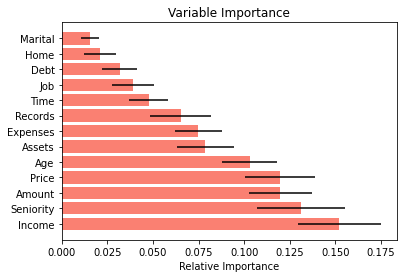
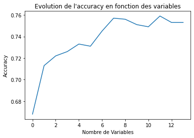
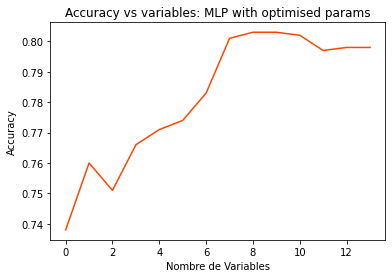
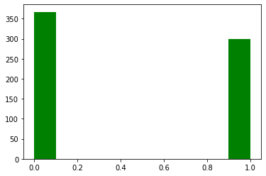
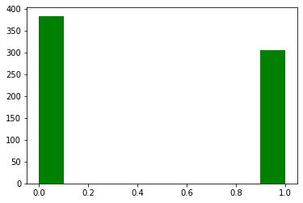

#### GALVIS Johanna
# <font color='cadetblue'>SUPERVISED LEARNING (TP-AS)</font> 

# I. Feature engineering & Classification

## I. 1 data preparation


```python
import numpy as np
np.set_printoptions(threshold=10000,suppress=True)
import pandas as pd
import warnings
import matplotlib.pyplot as plt
from sklearn import model_selection
warnings.filterwarnings('ignore')
```


```python
# preparing the data
credd = pd.read_csv("credit_scoring.csv", sep=";", header=0)
```


```python
credd.head(3) # variable bi-class 'Status' is the last column
```


<div>
<style scoped>
    .dataframe tbody tr th:only-of-type {
        vertical-align: middle;
    }

    .dataframe tbody tr th {
        vertical-align: top;
    }

    .dataframe thead th {
        text-align: right;
    }
</style>
<table border="1" class="dataframe">
  <thead>
    <tr style="text-align: right;">
      <th></th>
      <th>Seniority</th>
      <th>Home</th>
      <th>Time</th>
      <th>Age</th>
      <th>Marital</th>
      <th>Records</th>
      <th>Job</th>
      <th>Expenses</th>
      <th>Income</th>
      <th>Assets</th>
      <th>Debt</th>
      <th>Amount</th>
      <th>Price</th>
      <th>Status</th>
    </tr>
  </thead>
  <tbody>
    <tr>
      <th>0</th>
      <td>9.0</td>
      <td>1.0</td>
      <td>60.0</td>
      <td>30.0</td>
      <td>0.0</td>
      <td>1.0</td>
      <td>1.0</td>
      <td>73.0</td>
      <td>129.0</td>
      <td>0.0</td>
      <td>0.0</td>
      <td>800.0</td>
      <td>846.0</td>
      <td>1</td>
    </tr>
    <tr>
      <th>1</th>
      <td>17.0</td>
      <td>1.0</td>
      <td>60.0</td>
      <td>58.0</td>
      <td>1.0</td>
      <td>1.0</td>
      <td>0.0</td>
      <td>48.0</td>
      <td>131.0</td>
      <td>0.0</td>
      <td>0.0</td>
      <td>1000.0</td>
      <td>1658.0</td>
      <td>1</td>
    </tr>
    <tr>
      <th>2</th>
      <td>10.0</td>
      <td>0.0</td>
      <td>36.0</td>
      <td>46.0</td>
      <td>0.0</td>
      <td>2.0</td>
      <td>1.0</td>
      <td>90.0</td>
      <td>200.0</td>
      <td>3000.0</td>
      <td>0.0</td>
      <td>2000.0</td>
      <td>2985.0</td>
      <td>0</td>
    </tr>
  </tbody>
</table>
</div>


```python
credd.shape, f"NA values ==> {credd.isnull().sum().sum()}" #shape and CHECK IF empty (NaN, NA) cells
```


    ((4375, 14), 'NA values ==> 0')


```python
YstatusPS = credd.pop('Status') # detach this column from df
Ystatus = YstatusPS.to_numpy() # the numpy Y vector
```


```python
Ystatus.shape, credd.shape # verifying dimensions both objects
```


    ((4375,), (4375, 13))


```python
GP = 100*np.sum(Ystatus==1)/len(Ystatus) #good payers
BP = 100*np.sum(Ystatus==0)/len(Ystatus) #bad payers
print ('Good payers {0:.2f} %, Bad payers : {1:.2f}%'.format(GP,BP))
```

    Good payers 72.21 %, Bad payers : 27.79%


```python
Xcred = credd.values  # the numpy X array
Xcred.shape
```


    (4375, 13)


```python
labels = np.array([i for i in credd.head(0)])
```


```python
# split X into two matrices, same for Y vector.
# '_train' dataset is for learning phase and '_test' dataset is for prediction
Xcr_train, Xcr_test, Ycr_train, Ycr_test = model_selection.train_test_split(
Xcred, Ystatus, test_size=0.5, random_state=1) # random_state :  effect on the reproducibility of the results
```

The objective on 'credit_scoring' data is to predict good payers, in order to decide which client can have his/her credit approved.  We have splitted X matrix (4375 clients x 13 numerical variables) and Y class vector (4375 binary values) into two parts each, 'train' part for **learning** the model and the other one to **predict** Y class from a given X_test matrix. We need to select and train the most appropriate machine learning classifiers.

## I.2 Learning and evaluating models
Applying CART, KNN and Multilayer Perceptron to raw matrix


```python
from sklearn.tree import DecisionTreeClassifier
from sklearn.neighbors import KNeighborsClassifier
from sklearn.neural_network import MLPClassifier
from sklearn import tree
from sklearn.metrics import confusion_matrix, accuracy_score, precision_score, recall_score, roc_auc_score
from sklearn.preprocessing import StandardScaler, MinMaxScaler
```


```python
dtc = DecisionTreeClassifier(random_state=1) # "Gini" is default
dtc.fit(Xcr_train, Ycr_train) 
# normalization not compulsory, but missing values can yield errors. Already checked above
```


    DecisionTreeClassifier(random_state=1)


```python
#fig = plt.figure()
#_ = tree.plot_tree(dtc)
#fig.show(_)
```

this tree is wide and deep, in this case one solution can be pruning the tree, for the moment we will check predictions using the model without prunning.


```python
predicted = dtc.predict(Xcr_test)
print(confusion_matrix(Ycr_test, predicted))
```

    [[ 325  279]
     [ 318 1266]]


CAUTION: previous chunk via 'confusion_matrix' sklearn function yields a matrix following this less usual orientation:

|     | pred => |   0   |   1   | 
|-----|---------|-------|-------|
|   o |  0      |  TN   |  FP   | 
|   b |  1      |  FN   |  TP   | 
|   s |         |       |       |


More often the matrix is presented in this way (wikipedia for example):

|     | obs =>  |   1   |   0   | 
|-----|---------|-------|-------|
|   p |  1      |  TP   |  FP   | 
|   r |  0      |  FN   |  TN   | 
|   d |         |       |       |

FP : a customer being predicted default but in reality he/she's a good payer.
FN : a customer being predicted good payer but who will actually default.
For self-educational purposes, I created function `getcalcCM` to calculate confusion matrix derived scores: 


```python
def getcalcCM(confusionMat, poplength): #confusion matrix MUST EXIST in this order (TEST, predicted)
    specificity = confusionMat[0,0] / confusionMat[0].sum() #TN/TN+FP
    precision = confusionMat[1,1] / (confusionMat[0,1]+confusionMat[1,1]) # TP/(TP+FP)
    accuracy = (confusionMat[0,0]+confusionMat[1,1]) / poplength  
    recall =  confusionMat[1,1] / confusionMat[1].sum()
    return accuracy, precision, recall, specificity
# check my estimators custom function is ok:
CM = confusion_matrix(Ycr_test, predicted)
print(CM)
m,n,r,s = getcalcCM(CM, len(Ycr_test))
print("is my accuracy equal to metrics.accuracy_score?: {}".format(m == accuracy_score(Ycr_test,predicted)))
print("is my accuracy equal to metrics.recall_score?: {}".format(r == recall_score(Ycr_test,predicted)))
```

    [[ 325  279]
     [ 318 1266]]
    is my accuracy equal to metrics.accuracy_score?: True
    is my accuracy equal to metrics.recall_score?: True


```python
# COMPARING THREE CLASSIFIERS : CART, KNN, MLP
def CART_KNN_MLP(Xtrain, Xtest, Ytrain, Ytest):
    dtc = DecisionTreeClassifier(random_state=1) # "Gini" is default
    dtc.fit(Xtrain, Ytrain) 
    pred_tree = dtc.predict(Xtest)
    C = confusion_matrix(Ytest,pred_tree)
    print('CART (decision tree)')
    acc, pr, rc, sp = getcalcCM(C, len(Ytest))
    print('  accuracy:{0:.2f}%, precision : {1:.2f}%, recall : {2:.2f}%'.format(acc*100, pr*100, rc*100))
    
    knnmod = KNeighborsClassifier(n_neighbors = 5)
    knnmod.fit(Xtrain, Ytrain)
    predicted_knn = knnmod.predict(Xtest)
    print('KNN, 5 neighbors')
    C = confusion_matrix(Ytest, predicted_knn)
    acc, pr, rc, sp = getcalcCM(C, len(Ytest))
    print('  accuracy:{0:.2f}%, precision : {1:.2f}%, recall : {2:.2f}%'.format(acc*100, pr*100, rc*100))
    
    mlpcla = MLPClassifier(solver='lbfgs', alpha=1e-5, hidden_layer_sizes=(40,20), random_state=1)
    mlpcla.fit(Xtrain, Ytrain)
    predicted_mlp = mlpcla.predict(Xtest)
    print('MLP: 2 layers (40,20)')
    C = confusion_matrix(Ytest, predicted_mlp)
    acc, pr, rc, sp = getcalcCM(C, len(Ytest))
    print('  accuracy:{0:.2f}%, precision : {1:.2f}%, recall : {2:.2f}%'.format(acc*100, pr*100, rc*100))
    return 'ended function'
```


```python
# COMPARING THESE THREE CLASSIFIERS
CART_KNN_MLP(Xcr_train, Xcr_test, Ycr_train, Ycr_test)
```

    CART (decision tree)
      accuracy:72.71%, precision : 81.94%, recall : 79.92%
    KNN, 5 neighbors
      accuracy:72.49%, precision : 77.10%, recall : 88.19%
    MLP: 2 layers (40,20)
      accuracy:72.39%, precision : 72.39%, recall : 100.00%


    'ended function'


 I think, for predicting the clients suitable to be receive a credit approval,  we need a higher **precision** rate, because even if we reject people who maybe would in reality be good credit payers,
we do not want to risk in lending money to any single person that is likely not going to pay. A small set of clients with unpaid debts can potentially sum up big amounts of money, so we prefer to be highly selective. (Let's suppose a recently founded ethical bank is involved in this exercice, on the other hand a huge corp that can afford risks would prefer recall to be maximised).

In an opposite exemple, to detect a disease, we'd prefere to have a high recall even if 
precision is low, as we wont want to take the risk of letting people die because under-diagnosis.


## I.3 NORMALIZED DATA :  running again CART, KNN and MLP


```python
scaler = StandardScaler()
Xnorm_train  = scaler.fit_transform(Xcr_train)
# learn scale params first, so they can be used later when scaling 'test' data
Xnorm_test = scaler.transform(Xcr_test)
```


```python
CART_KNN_MLP(Xnorm_train, Xnorm_test, Ycr_train, Ycr_test)
```

    CART (decision tree)
      accuracy:72.71%, precision : 81.82%, recall : 80.11%
    KNN, 5 neighbors
      accuracy:75.27%, precision : 81.06%, recall : 85.92%
    MLP: 2 layers (40,20)
      accuracy:72.30%, precision : 81.84%, recall : 79.36%


    'ended function'


## I.4 Adding new variables from PCA
These variables are linear combinations of original variables


```python
from sklearn.decomposition import PCA
```


```python
pca = PCA(n_components=3)
pca.fit(Xnorm_train) # here training set only
Xpca_train = pca.transform(Xnorm_train) 
Xpca_train = np.concatenate((Xpca_train,Xnorm_train), axis=1)
Xpca_train.shape
```


    (2187, 16)


```python
Xpca_test = pca.transform(Xnorm_test)
Xpca_test = np.concatenate((Xpca_test,Xnorm_test), axis=1)
Xpca_test.shape
```


    (2188, 16)


```python
CART_KNN_MLP(Xnorm_train, Xnorm_test, Ycr_train, Ycr_test)
```

    CART (decision tree)
      accuracy:72.71%, precision : 81.82%, recall : 80.11%
    KNN, 5 neighbors
      accuracy:75.27%, precision : 81.06%, recall : 85.92%
    MLP: 2 layers (40,20)
      accuracy:72.30%, precision : 81.84%, recall : 79.36%


    'ended function'


```python
CART_KNN_MLP(Xpca_train, Xpca_test, Ycr_train, Ycr_test)
```

    CART (decision tree)
      accuracy:71.66%, precision : 82.01%, recall : 77.97%
    KNN, 5 neighbors
      accuracy:75.64%, precision : 81.04%, recall : 86.62%
    MLP: 2 layers (40,20)
      accuracy:72.67%, precision : 82.01%, recall : 79.73%


    'ended function'


The worst accuracy comes from CART prediction, indeed worsen when scaling the data. Tree-based classifiers often encounter this problems, as correlation between variables is not taken in account by the algorithm:
<div class="alert alert-block alert-warning">
<b>NOTE:</b>  TREES DO NOT CONSIDER CORRELATION BETWEEN VARIABLES, IT TREATS EACH VARIABLE DIFFERENTLY FROM THE OTHERS IN ORDER TO CLASSIFY PERTINENT ONES
</div>

Best accuracy is achieved by KNN both with scaling and scaling + 'PCA derived variables'. Very similar precision was obtained for KNN and MLP:  accuracy was ~2% higher for KNN, but precision 1% higher for MLP.

## I.5 Pick out variables : first approach with Random Forest (not optimized)


```python
from sklearn.ensemble import RandomForestClassifier
```


```python
def important_vars(Xtrain_scale, Y1,  nom_cols):
    clf = RandomForestClassifier(n_estimators=100)
    clf.fit(Xtrain_scale, Y1)
    importances=clf.feature_importances_
    std = np.std([tree.feature_importances_ for tree in clf.estimators_],axis=0)
    sorted_idx = np.argsort(importances)[::-1]
    features = nom_cols
    print(features[sorted_idx])
    padding = np.arange(Xtrain_scale.size/len(Xtrain_scale)) + 0.5
    plt.barh(padding, importances[sorted_idx],xerr=std[sorted_idx], align='center', color="salmon")
    plt.yticks(padding, features[sorted_idx])
    plt.xlabel("Relative Importance")
    plt.title("Variable Importance")
    plt.show()
    return [(i,j) for i,j in zip(features[sorted_idx], sorted_idx)]
```


```python
varsimpor_l = important_vars(Xnorm_train, Ycr_train, labels )
```

    ['Income' 'Seniority' 'Amount' 'Price' 'Age' 'Assets' 'Expenses' 'Records'
     'Time' 'Job' 'Debt' 'Home' 'Marital']


    

    


```python
print("List ordered with 'Income' being the most important (located at column 8 in matrix):")
print()
print([t for t in varsimpor_l])
```

    List ordered with 'Income' being the most important (located at column 8 in matrix):
    
    [('Income', 8), ('Seniority', 0), ('Amount', 11), ('Price', 12), ('Age', 3), ('Assets', 9), ('Expenses', 7), ('Records', 5), ('Time', 2), ('Job', 6), ('Debt', 10), ('Home', 1), ('Marital', 4)]


```python
def plot_accurVsVars(Xtrain_scale, Xtest_scale, Ytrain, Ytest, sorted_idx ):
    KNN=KNeighborsClassifier(n_neighbors=5)
    scores=np.zeros(Xtrain_scale.shape[1]+1)
    # iteratively add variables in importance order!: 8, 0 ... 4 
    for f in np.arange(0, Xtrain_scale.shape[1]+1):
        X1_f = Xtrain_scale[:,sorted_idx[:f+1]]
        X2_f = Xtest_scale[:,sorted_idx[:f+1]]
        KNN.fit(X1_f,Ytrain)
        YKNN=KNN.predict(X2_f)
        scores[f]=np.round(accuracy_score(Ytest,YKNN),3)
    plt.plot(scores)
    plt.xlabel("Nombre de Variables")
    plt.ylabel("Accuracy")
    plt.title("Evolution de l'accuracy en fonction des variables")
    return plt.show()

plot_accurVsVars(Xnorm_train, Xnorm_test, Ycr_train, Ycr_test, [i[1] for i in varsimpor_l])    
```


    

    


This plot shows that accuracy achieves its max (0.76) when including first 11 variables 

<div class="alert alert-block alert-warning">
<b>BE CAREFUL:</b>these variables have been "scored" only by means of KNN 
 arbitrarily set with 5 neighbors, no tuning yet performed.  
</div>
 
So lets  choose best parameters first


## I.6 EFFICIENT PARAMETER TUNING : GridSearchCV


```python
# KNN (only accuracy to optimize)
parknn = {  
   'n_neighbors': [5,7,11,13,15],
    'weights' : ['uniform', 'distance']
} 
grid_knnAcc = model_selection.GridSearchCV(KNeighborsClassifier(), parknn, cv=5,
                                         scoring='accuracy')
grid_knnAcc.fit(Xnorm_train, Ycr_train)
print(grid_knnAcc.best_params_)
print(grid_knnAcc.best_score_) 
knn_predAccu = grid_knnAcc.predict(Xnorm_test)
print(f'  KNN grid accuracy  : {accuracy_score(Ycr_test, knn_predAccu)}')
print(f'  KNN grid precision : {precision_score(Ycr_test, knn_predAccu)}')
```

    {'n_neighbors': 13, 'weights': 'distance'}
    0.7695453643041492
      KNN grid accuracy  : 0.7723948811700183
      KNN grid precision : 0.8120689655172414


```python
## KNN (accuracy and precision to optim): 
grid_knn = model_selection.GridSearchCV(KNeighborsClassifier(), parknn, cv=5,
                                        refit='precision', scoring=['accuracy', 'precision'])
grid_knn.fit(Xnorm_train, Ycr_train)
print(grid_knn.best_params_)
print(grid_knn.best_score_) 
knn_pred_g = grid_knn.predict(Xnorm_test)
print(f'  KNN refit accuracy  : {accuracy_score(Ycr_test, knn_pred_g)}')
print(f'  KNN refit precision : {precision_score(Ycr_test, knn_pred_g)}')
```

    {'n_neighbors': 13, 'weights': 'distance'}
    0.8068875952791092
      KNN refit accuracy  : 0.7723948811700183
      KNN refit precision : 0.8120689655172414


 KNN: no substantial difference between accuracy vs. accuracy+precision+refit when tuning
 lets see if same happens for MLP


```python
## MLP (only accuracy to optimize):   
parmlp = {
    'hidden_layer_sizes': [(40,20), (45,23) , (50,30)],
    'activation' : ['tanh', 'relu'],
    'alpha' : [1e-3, 1e-4, 1e-5],
    'solver' : ['lbfgs', 'sgd', 'adam'],
    'max_iter' : [100,200]
}
grid_mlpAccu = model_selection.GridSearchCV(MLPClassifier(), parmlp, cv=5, n_jobs=4,
                              scoring='accuracy') 
grid_mlpAccu.fit(Xnorm_train, Ycr_train)
print(grid_mlpAccu.best_params_)
print(grid_mlpAccu.best_score_)
mlp_predAccu = grid_mlpAccu.predict(Xnorm_test)
print(accuracy_score(Ycr_test, mlp_predAccu))
print(precision_score(Ycr_test, mlp_predAccu))
```

    {'activation': 'tanh', 'alpha': 1e-05, 'hidden_layer_sizes': (50, 30), 'max_iter': 200, 'solver': 'sgd'}
    0.7923910431229951
    0.7943327239488117
    0.8214285714285714


```python
## MLP (accuracy and precision to optim):   
parmlp = {
    'hidden_layer_sizes': [(40,20), (45,23) , (50,30)],
    'activation' : ['tanh', 'relu'],
    'alpha' : [1e-3, 1e-4, 1e-5],
    'solver' : ['lbfgs', 'sgd', 'adam'],
    'max_iter' : [100,200]
}
grid_mlp = model_selection.GridSearchCV(MLPClassifier(), parmlp, cv=5, n_jobs=4,
                              refit='precision', scoring=['accuracy', 'precision']) 
grid_mlp.fit(Xnorm_train, Ycr_train)
print(grid_mlp.best_params_)
print(grid_mlp.best_score_)
mlp_pred_g = grid_mlp.predict(Xnorm_test)
print(accuracy_score(Ycr_test, mlp_pred_g))
print(precision_score(Ycr_test, mlp_pred_g))
```

    {'activation': 'relu', 'alpha': 0.001, 'hidden_layer_sizes': (40, 20), 'max_iter': 100, 'solver': 'adam'}
    0.839080876410055
    0.7915904936014625
    0.8460122699386503


MLP: optimising only accuracy yields better prediction in terms of accuracy and precision


```python
# CART
parcart = {
    'criterion' : ['gini'],
    'max_depth' : [3,5,7],
    'min_samples_split' : [2,4],
    'random_state' : [1]
    
}
grid_cart = model_selection.GridSearchCV(DecisionTreeClassifier(), parcart, cv=5,
                                        scoring='accuracy')
grid_cart.fit(Xnorm_train, Ycr_train)
print(grid_cart.best_params_)
print(grid_cart.best_score_) 
cart_pred_g = grid_cart.predict(Xnorm_test)
print(f'  CART grid accuracy  :{accuracy_score(Ycr_test, cart_pred_g)}')
print(f'  CART grid accuracy  :{precision_score(Ycr_test, cart_pred_g)}')
```

    {'criterion': 'gini', 'max_depth': 3, 'min_samples_split': 2, 'random_state': 1}
    0.7576596344942165
      CART grid accuracy  :0.7605118829981719
      CART grid accuracy  :0.7740434332988625


*GridSearchCV* made it easier to find best parameters for these three classifiers. We obtained as optimized parameters using the training dataset X and its class vector Y:

  - KNN: {'n_neighbors': 13, 'weights': 'distance'}

  - MLP:  {'activation': 'tanh', 'alpha': 0.001, 'hidden_layer_sizes': (50, 30), 'max_iter': 100, 'solver': 'adam'}

  - CART: {'criterion': 'entropy', 'max_depth': 5, 'min_samples_split': 2, 'random_state': 1}

*MLP* reported the best accuracy and precision (79,43% and 84,23%, respectively) on Y prediction for normalized X test dataset using optimized parameters. However random re-sampling will be introduced (cross-validation), to add robustness to 'best clasifier' selection at section **'Comparing learning algorithms'**.


#### I.7 A ways to 'INDUSTRIALIZE' prediction : Pipeline


```python
import pickle
from sklearn.pipeline import Pipeline, FeatureUnion
```


```python
mixfeat = FeatureUnion([('pca', PCA(n_components=3))])
             
pipeline = Pipeline( [
    ('ss', StandardScaler()),
    ('combinedf', mixfeat),
     ('knn', KNeighborsClassifier(n_neighbors=13, weights='distance'))
])
pipeline.fit(Xcr_train, Ycr_train)
pr = pipeline.predict(Xcr_test)
confusion_matrix(Ycr_test, pr)
print(accuracy_score(Ycr_test,pr))
 
fileo = open("pipeBANK.pkl", 'wb')
pickle.dump(pipeline, fileo)  # save binary
```

    0.7102376599634369


```python
# HOW TO USE SAVED PIPELINE :  
# lets say we have 2 new clients:
Xmintest = Xcr_test[8:10,0:]  # "2 new clients"
ppline=pickle.load(open( "pipeBANK.pkl", "rb" ) ) 
ppline.predict_proba(Xmintest)
# if I want to predictions for specific variable
# ppline.predict_proba(test.values[:,var1])  
# """ END pipeline part """
```


    array([[0.07661766, 0.92338234],
           [0.53295434, 0.46704566]])


## I.8 Comparing learning algorithms (Comparaison de plusieurs algorithmes d’apprentissage)


```python
from sklearn.ensemble import AdaBoostClassifier, BaggingClassifier
from sklearn.naive_bayes import GaussianNB
from sklearn.model_selection import cross_val_score, KFold
import time
clfs = {
    'RF': RandomForestClassifier(n_estimators=50, random_state=1),
    'KNN': KNeighborsClassifier(n_neighbors=13, weights='distance'),
    'ADA' : AdaBoostClassifier(n_estimators=50, random_state=1),
    'BAG' : BaggingClassifier(n_estimators=50), 
    'MLP' : MLPClassifier(activation='tanh', alpha=0.001, 
                          hidden_layer_sizes=(50, 30), max_iter=100, solver='adam'),
    'NB' : GaussianNB(),
    'CART' : DecisionTreeClassifier(criterion='gini', max_depth=3, random_state=1),
    'ID3' : DecisionTreeClassifier(criterion='entropy', random_state=1),
    'ST' : DecisionTreeClassifier(max_depth=1, random_state=1) #decisionStump
}
```

The function 'run_classifiers' performs cross-validation, the results are stocked in a dictionnary for comparisons that helps to retain the best classifier. It uses 'KFold' which performs re-sampling (no preliminary splitting 'test' and 'train' needed). 


```python
def run_classifiers(clfs, X, Y):
    dico = {'classifier':[],'accuracy_mean':[],'accuracy_sd':[], 
             'precision_mean':[], 'precision_sd':[],
            'AUC':[], 'time_s':[]} #output into dictionnary
    kf = KFold(n_splits=5, shuffle=True, random_state=0)
    for clf_id in clfs:
        initime = time.time()
        clf = clfs[clf_id]
        cvAccur = cross_val_score(clf, X, Y, cv=kf, n_jobs=4)
        end = time.time()
        cvPrecision = cross_val_score(clf, X, Y, cv=kf, scoring='precision', n_jobs=4)
        cvAUC = cross_val_score(clf, X, Y, cv=kf, scoring='roc_auc', n_jobs=4)
        dico['classifier'].append(clf_id)
        dico['accuracy_mean'].append(round(np.mean(cvAccur),3)),
        dico['accuracy_sd'].append(round(np.std(cvAccur),3)),
        dico['precision_mean'].append(round(np.mean(cvPrecision),3)),
        dico['precision_sd'].append(round(np.std(cvPrecision),3))
        dico['AUC'].append(round(np.mean(cvAUC),3))
        dico['time_s'].append(round((end-initime),3))
    return dico
            
```


```python
scaler = StandardScaler()
XnormALL  = scaler.fit_transform(Xcred)
# As function uses 'KFold' splitting data as in previous steps is no longer necessary:
dicores = run_classifiers(clfs, XnormALL, Ystatus)
```


```python
tabres = pd.DataFrame.from_dict(dicores)
tabres.sort_values(by=['accuracy_mean', 'precision_mean', 'AUC'], ascending=False)
```


<div>
<style scoped>
    .dataframe tbody tr th:only-of-type {
        vertical-align: middle;
    }

    .dataframe tbody tr th {
        vertical-align: top;
    }

    .dataframe thead th {
        text-align: right;
    }
</style>
<table border="1" class="dataframe">
  <thead>
    <tr style="text-align: right;">
      <th></th>
      <th>classifier</th>
      <th>accuracy_mean</th>
      <th>accuracy_sd</th>
      <th>precision_mean</th>
      <th>precision_sd</th>
      <th>AUC</th>
      <th>time_s</th>
    </tr>
  </thead>
  <tbody>
    <tr>
      <th>4</th>
      <td>MLP</td>
      <td>0.795</td>
      <td>0.009</td>
      <td>0.834</td>
      <td>0.011</td>
      <td>0.831</td>
      <td>3.292</td>
    </tr>
    <tr>
      <th>2</th>
      <td>ADA</td>
      <td>0.791</td>
      <td>0.009</td>
      <td>0.823</td>
      <td>0.012</td>
      <td>0.829</td>
      <td>0.309</td>
    </tr>
    <tr>
      <th>0</th>
      <td>RF</td>
      <td>0.783</td>
      <td>0.005</td>
      <td>0.821</td>
      <td>0.009</td>
      <td>0.818</td>
      <td>0.518</td>
    </tr>
    <tr>
      <th>1</th>
      <td>KNN</td>
      <td>0.776</td>
      <td>0.009</td>
      <td>0.812</td>
      <td>0.012</td>
      <td>0.798</td>
      <td>0.149</td>
    </tr>
    <tr>
      <th>3</th>
      <td>BAG</td>
      <td>0.774</td>
      <td>0.005</td>
      <td>0.824</td>
      <td>0.007</td>
      <td>0.813</td>
      <td>1.060</td>
    </tr>
    <tr>
      <th>5</th>
      <td>NB</td>
      <td>0.769</td>
      <td>0.010</td>
      <td>0.847</td>
      <td>0.017</td>
      <td>0.796</td>
      <td>0.041</td>
    </tr>
    <tr>
      <th>6</th>
      <td>CART</td>
      <td>0.753</td>
      <td>0.011</td>
      <td>0.812</td>
      <td>0.009</td>
      <td>0.748</td>
      <td>0.018</td>
    </tr>
    <tr>
      <th>8</th>
      <td>ST</td>
      <td>0.727</td>
      <td>0.009</td>
      <td>0.753</td>
      <td>0.017</td>
      <td>0.616</td>
      <td>0.012</td>
    </tr>
    <tr>
      <th>7</th>
      <td>ID3</td>
      <td>0.715</td>
      <td>0.006</td>
      <td>0.803</td>
      <td>0.007</td>
      <td>0.645</td>
      <td>0.041</td>
    </tr>
  </tbody>
</table>
</div>


<div class="alert alert-block alert-success">
<b>Best classifiers for predicting good payers:</b> MLP exhibits best accuracy, precision 
    and Area Under the Curve (AUC). 
</div>
ADA, RF and BAG perform very similar, whereas KNN and NB see their AUC diminish (false positive rate increments at the cost of true positive rate reduction). 

## I.9 Use optimal classifier to check variables vs accuracy


```python
def plot_accurVsVars(Xtrain_scale, Xtest_scale, Ytrain, Ytest, sorted_idx ):
    meth=MLPClassifier(activation='tanh', alpha=0.001, 
                          hidden_layer_sizes=(50, 30), max_iter=100, 
                       solver='adam', random_state=1)
    scores=np.zeros(Xtrain_scale.shape[1]+1)
    for f in np.arange(0, Xtrain_scale.shape[1]+1):
        X1_f = Xtrain_scale[:,sorted_idx[:f+1]]
        X2_f = Xtest_scale[:,sorted_idx[:f+1]]
        meth.fit(X1_f,Ytrain)
        Ypred=meth.predict(X2_f)
        scores[f]=np.round(accuracy_score(Ytest,Ypred),3)
    plt.plot(scores, color="orangered")
    plt.xlabel("Nombre de Variables")
    plt.ylabel("Accuracy")
    plt.title("Accuracy vs variables: MLP with optimised params")
    return plt.show()
```


```python
plot_accurVsVars(Xnorm_train, Xnorm_test, Ycr_train, Ycr_test, [i[1] for i in varsimpor_l])  
```


    

    


  To recall, number of variables (x axis) is not the same as column order in the matrix [x=1 --> ('Income', 8),  x=2 --> ('Seniority', 0), x=3 --> ('Amount', 11), x=4 --> ('Price', 12), x=5 --> ('Age', 3), x=6 --> ('Assets', 9), x=7 --> ('Expenses', 7), x=8 --> ('Records', 5), x=9 --> ('Time', 2), x=10 --> ('Job', 6), x=11 --> ('Debt', 10), x=12 --> ('Home', 1), x=13 --> ('Marital', 4)] .  In this figure above, variables Time, Job, DEbt, Home, Marital are the reduntant ones. (Caution!, this changed several times even with random_state=1, in  some runs I have obtained only Marital as redundant.


<div class="alert alert-block alert-success">
<b>Accuracy vs variables (OPTIMIZED):</b> 
 If redundant variables are detected it is necessary to filter them out and re-run tuning (GridCV) and crossvalidation. We have also to be careful with overfitting (*sur-apprentissage*): the model only capable to predict about specific data but not being able to generalize. This is frequent when 'noisy' variables are not correctly detected and excluded.
</div>

# II. Heterogeneous Data
## II.1 Data preparation and Normalization
This new dataset is also related to bank clients, being the class to predict: credit aproval(1) vs rejection(0).


```python
hetcr = pd.read_csv("credit.data", sep='\t', header=None)
```


```python
hetcr.head(2)  # as we see, column names are just numbers from 0 to 15
```


<div>
<style scoped>
    .dataframe tbody tr th:only-of-type {
        vertical-align: middle;
    }

    .dataframe tbody tr th {
        vertical-align: top;
    }

    .dataframe thead th {
        text-align: right;
    }
</style>
<table border="1" class="dataframe">
  <thead>
    <tr style="text-align: right;">
      <th></th>
      <th>0</th>
      <th>1</th>
      <th>2</th>
      <th>3</th>
      <th>4</th>
      <th>5</th>
      <th>6</th>
      <th>7</th>
      <th>8</th>
      <th>9</th>
      <th>10</th>
      <th>11</th>
      <th>12</th>
      <th>13</th>
      <th>14</th>
      <th>15</th>
    </tr>
  </thead>
  <tbody>
    <tr>
      <th>0</th>
      <td>b</td>
      <td>30.83</td>
      <td>0.00</td>
      <td>u</td>
      <td>g</td>
      <td>w</td>
      <td>v</td>
      <td>1.25</td>
      <td>t</td>
      <td>t</td>
      <td>1</td>
      <td>f</td>
      <td>g</td>
      <td>202</td>
      <td>0</td>
      <td>+</td>
    </tr>
    <tr>
      <th>1</th>
      <td>a</td>
      <td>58.67</td>
      <td>4.46</td>
      <td>u</td>
      <td>g</td>
      <td>q</td>
      <td>h</td>
      <td>3.04</td>
      <td>t</td>
      <td>t</td>
      <td>6</td>
      <td>f</td>
      <td>g</td>
      <td>43</td>
      <td>560</td>
      <td>+</td>
    </tr>
  </tbody>
</table>
</div>


```python
rawM = hetcr.values
X = np.copy(rawM[:,0:15]) # variables caractéristiques
Y = np.copy(rawM[:,15]) # var à prédire (target)
Y[Y == '+'] = 1
Y[Y == '-'] = 0
Y = Y.astype(int)
col_num = [1, 2, 7, 10, 13, 14 ]  # numerical vars
col_cat = [i for i in range(15) if i not in col_num] # categorical
print(np.isnan(Y[0]))  # check Y does not contain missing values 
```

    False


In this credit.data we have categorical and numerical variables in same matrix, presenting **Missing values**, that will be treated.
1.  A first approach using only numerical variables and droping out individuals having missing values
2.  secondly, imputation method to both numerical and categorical missing values,  and concatenate both to run classifiers.


```python
X_num = np.copy(X[:, col_num])  # get only numerical
X_num[X_num == '?'] = np.nan  # missing values in X set to nan
X_num = X_num.astype(float)
```


```python
# delete subjects, from X and Y,  having nan in at least one column in X
Ycut = Y[~np.isnan(X_num).any(axis=1)]
Xnumcut = X_num[~np.isnan(X_num).any(axis=1)]
```


```python
Xnumcut.shape, Ycut.shape
```


    ((666, 6), (666,))


```python
plt.hist(Ycut, color='green')
```


    (array([367.,   0.,   0.,   0.,   0.,   0.,   0.,   0.,   0., 299.]),
     array([0. , 0.1, 0.2, 0.3, 0.4, 0.5, 0.6, 0.7, 0.8, 0.9, 1. ]),
     <BarContainer object of 10 artists>)


    

    


```python
plt.hist(Y, color ="green")
```


    (array([383.,   0.,   0.,   0.,   0.,   0.,   0.,   0.,   0., 305.]),
     array([0. , 0.1, 0.2, 0.3, 0.4, 0.5, 0.6, 0.7, 0.8, 0.9, 1. ]),
     <BarContainer object of 10 artists>)


    

    


```python
hetercl = run_classifiers(clfs, Xnumcut, Ycut) # a dictionnary
```


```python
hetetab = pd.DataFrame.from_dict(hetercl)
print("Crossvalidation on non-normalized numerical-only matrix:")
hetetab.sort_values(by=['accuracy_mean', 'precision_mean', 'AUC'], ascending=False)
```

    Crossvalidation on non-normalized numerical-only matrix:


<div>
<style scoped>
    .dataframe tbody tr th:only-of-type {
        vertical-align: middle;
    }

    .dataframe tbody tr th {
        vertical-align: top;
    }

    .dataframe thead th {
        text-align: right;
    }
</style>
<table border="1" class="dataframe">
  <thead>
    <tr style="text-align: right;">
      <th></th>
      <th>classifier</th>
      <th>accuracy_mean</th>
      <th>accuracy_sd</th>
      <th>precision_mean</th>
      <th>precision_sd</th>
      <th>AUC</th>
      <th>time_s</th>
    </tr>
  </thead>
  <tbody>
    <tr>
      <th>0</th>
      <td>RF</td>
      <td>0.790</td>
      <td>0.042</td>
      <td>0.803</td>
      <td>0.034</td>
      <td>0.855</td>
      <td>0.176</td>
    </tr>
    <tr>
      <th>3</th>
      <td>BAG</td>
      <td>0.785</td>
      <td>0.044</td>
      <td>0.781</td>
      <td>0.048</td>
      <td>0.839</td>
      <td>0.206</td>
    </tr>
    <tr>
      <th>2</th>
      <td>ADA</td>
      <td>0.781</td>
      <td>0.023</td>
      <td>0.790</td>
      <td>0.053</td>
      <td>0.830</td>
      <td>0.135</td>
    </tr>
    <tr>
      <th>6</th>
      <td>CART</td>
      <td>0.755</td>
      <td>0.036</td>
      <td>0.836</td>
      <td>0.031</td>
      <td>0.799</td>
      <td>0.008</td>
    </tr>
    <tr>
      <th>7</th>
      <td>ID3</td>
      <td>0.752</td>
      <td>0.021</td>
      <td>0.734</td>
      <td>0.048</td>
      <td>0.750</td>
      <td>0.008</td>
    </tr>
    <tr>
      <th>8</th>
      <td>ST</td>
      <td>0.743</td>
      <td>0.042</td>
      <td>0.861</td>
      <td>0.064</td>
      <td>0.722</td>
      <td>0.006</td>
    </tr>
    <tr>
      <th>4</th>
      <td>MLP</td>
      <td>0.737</td>
      <td>0.036</td>
      <td>0.748</td>
      <td>0.033</td>
      <td>0.816</td>
      <td>0.467</td>
    </tr>
    <tr>
      <th>5</th>
      <td>NB</td>
      <td>0.715</td>
      <td>0.028</td>
      <td>0.819</td>
      <td>0.026</td>
      <td>0.794</td>
      <td>0.006</td>
    </tr>
    <tr>
      <th>1</th>
      <td>KNN</td>
      <td>0.695</td>
      <td>0.031</td>
      <td>0.707</td>
      <td>0.044</td>
      <td>0.748</td>
      <td>0.008</td>
    </tr>
  </tbody>
</table>
</div>


For this crossvalidation, we excluded all rows containing missing values. As we can see in the table above, ordered by accuracy, precision and AUC in descending values, **RF is the best classifier** . Below, the table with normalized matrix shows very similar results.


```python
## -- Centered-reduced data:
scaler = StandardScaler()
Xnormcut = scaler.fit_transform(Xnumcut)
heternorm = run_classifiers(clfs, Xnormcut, Ycut)
```


```python
heter_nrm_t =  pd.DataFrame.from_dict(heternorm)
print("Crossvalidation on *Normalized* numerical-only matrix:")
heter_nrm_t.sort_values(by=['accuracy_mean', 'precision_mean', 'AUC'], ascending=False)
```

    Crossvalidation on *Normalized* numerical-only matrix:


<div>
<style scoped>
    .dataframe tbody tr th:only-of-type {
        vertical-align: middle;
    }

    .dataframe tbody tr th {
        vertical-align: top;
    }

    .dataframe thead th {
        text-align: right;
    }
</style>
<table border="1" class="dataframe">
  <thead>
    <tr style="text-align: right;">
      <th></th>
      <th>classifier</th>
      <th>accuracy_mean</th>
      <th>accuracy_sd</th>
      <th>precision_mean</th>
      <th>precision_sd</th>
      <th>AUC</th>
      <th>time_s</th>
    </tr>
  </thead>
  <tbody>
    <tr>
      <th>0</th>
      <td>RF</td>
      <td>0.791</td>
      <td>0.046</td>
      <td>0.806</td>
      <td>0.040</td>
      <td>0.855</td>
      <td>0.169</td>
    </tr>
    <tr>
      <th>2</th>
      <td>ADA</td>
      <td>0.781</td>
      <td>0.023</td>
      <td>0.790</td>
      <td>0.053</td>
      <td>0.830</td>
      <td>0.139</td>
    </tr>
    <tr>
      <th>3</th>
      <td>BAG</td>
      <td>0.776</td>
      <td>0.046</td>
      <td>0.780</td>
      <td>0.033</td>
      <td>0.832</td>
      <td>0.215</td>
    </tr>
    <tr>
      <th>4</th>
      <td>MLP</td>
      <td>0.773</td>
      <td>0.026</td>
      <td>0.806</td>
      <td>0.008</td>
      <td>0.846</td>
      <td>0.493</td>
    </tr>
    <tr>
      <th>6</th>
      <td>CART</td>
      <td>0.755</td>
      <td>0.036</td>
      <td>0.836</td>
      <td>0.031</td>
      <td>0.799</td>
      <td>0.007</td>
    </tr>
    <tr>
      <th>7</th>
      <td>ID3</td>
      <td>0.752</td>
      <td>0.021</td>
      <td>0.734</td>
      <td>0.048</td>
      <td>0.750</td>
      <td>0.009</td>
    </tr>
    <tr>
      <th>1</th>
      <td>KNN</td>
      <td>0.751</td>
      <td>0.048</td>
      <td>0.814</td>
      <td>0.046</td>
      <td>0.833</td>
      <td>0.009</td>
    </tr>
    <tr>
      <th>8</th>
      <td>ST</td>
      <td>0.743</td>
      <td>0.042</td>
      <td>0.861</td>
      <td>0.064</td>
      <td>0.722</td>
      <td>0.006</td>
    </tr>
    <tr>
      <th>5</th>
      <td>NB</td>
      <td>0.715</td>
      <td>0.028</td>
      <td>0.819</td>
      <td>0.026</td>
      <td>0.794</td>
      <td>0.006</td>
    </tr>
  </tbody>
</table>
</div>


## II.2 Treat Missing values : *imputer*
Preserve full X matrix,  impute variables including categorical ones


```python
from sklearn.impute import SimpleImputer as Imputer
from sklearn.preprocessing import OneHotEncoder
```


```python
# treat numerical variables : 
imp_num = Imputer(missing_values=np.nan, strategy='mean')
X_num = imp_num.fit_transform(X_num)
```


```python
# treat categorical variables
X_cat = np.copy(X[:, col_cat])
for col_id in range(len(col_cat)):
    unique_val, val_idx = np.unique(X_cat[:, col_id], return_inverse=True)
    X_cat[:, col_id] = val_idx
imp_cat = Imputer(missing_values=0, strategy='most_frequent')
X_cat[:, range(5)] = imp_cat.fit_transform(X_cat[:, range(5)])
# to be able to use in run_classifiers, for a given variable
# transform m categories into m binary vars, being only one active
X_cat_bin = OneHotEncoder().fit_transform(X_cat).toarray()
```


```python
Xmerge = np.concatenate((X_num,X_cat_bin),axis=1)
Xmerge.shape
```


    (688, 46)


```python
hetefull = run_classifiers(clfs, Xmerge, Y)
hetefulltab = pd.DataFrame.from_dict(hetefull)
hetefulltab.sort_values(by=['accuracy_mean', 'precision_mean', 'AUC'], ascending=False)
```


<div>
<style scoped>
    .dataframe tbody tr th:only-of-type {
        vertical-align: middle;
    }

    .dataframe tbody tr th {
        vertical-align: top;
    }

    .dataframe thead th {
        text-align: right;
    }
</style>
<table border="1" class="dataframe">
  <thead>
    <tr style="text-align: right;">
      <th></th>
      <th>classifier</th>
      <th>accuracy_mean</th>
      <th>accuracy_sd</th>
      <th>precision_mean</th>
      <th>precision_sd</th>
      <th>AUC</th>
      <th>time_s</th>
    </tr>
  </thead>
  <tbody>
    <tr>
      <th>0</th>
      <td>RF</td>
      <td>0.866</td>
      <td>0.023</td>
      <td>0.843</td>
      <td>0.043</td>
      <td>0.933</td>
      <td>0.180</td>
    </tr>
    <tr>
      <th>3</th>
      <td>BAG</td>
      <td>0.863</td>
      <td>0.019</td>
      <td>0.839</td>
      <td>0.049</td>
      <td>0.925</td>
      <td>0.262</td>
    </tr>
    <tr>
      <th>8</th>
      <td>ST</td>
      <td>0.856</td>
      <td>0.036</td>
      <td>0.789</td>
      <td>0.056</td>
      <td>0.864</td>
      <td>0.007</td>
    </tr>
    <tr>
      <th>2</th>
      <td>ADA</td>
      <td>0.843</td>
      <td>0.029</td>
      <td>0.825</td>
      <td>0.038</td>
      <td>0.917</td>
      <td>0.156</td>
    </tr>
    <tr>
      <th>5</th>
      <td>NB</td>
      <td>0.839</td>
      <td>0.020</td>
      <td>0.855</td>
      <td>0.029</td>
      <td>0.918</td>
      <td>0.007</td>
    </tr>
    <tr>
      <th>6</th>
      <td>CART</td>
      <td>0.833</td>
      <td>0.013</td>
      <td>0.802</td>
      <td>0.072</td>
      <td>0.907</td>
      <td>0.008</td>
    </tr>
    <tr>
      <th>7</th>
      <td>ID3</td>
      <td>0.817</td>
      <td>0.028</td>
      <td>0.798</td>
      <td>0.035</td>
      <td>0.813</td>
      <td>0.011</td>
    </tr>
    <tr>
      <th>4</th>
      <td>MLP</td>
      <td>0.797</td>
      <td>0.055</td>
      <td>0.783</td>
      <td>0.061</td>
      <td>0.861</td>
      <td>0.548</td>
    </tr>
    <tr>
      <th>1</th>
      <td>KNN</td>
      <td>0.673</td>
      <td>0.040</td>
      <td>0.674</td>
      <td>0.050</td>
      <td>0.731</td>
      <td>0.011</td>
    </tr>
  </tbody>
</table>
</div>


The table above for this imputed dataset shows still RF(Random Forest) and BAG as best classifiers, however an important change occured in terms of prediction between "amputated" (rows with missing values just suppressed) vs imputed values.

The table below table contains **Random Forest** results on both types of data demonstrates that imputation improves the capacity of the model to achieve better parameters, we deduce that performance in prediction has boost, and it is also reflected in computational time which is also improved:


| RF on data...           | ACCURACY | PRECISION | AUC   | time  |
|-------------------------|----------|-----------|-------|-------|
| with 'amputated' values | 0.790    | 0.803     | 0.855 | 0.373 |
| with imputed variables  | **0.866**    | 0.848     | **0.933** | 0.361 |
|                         |          |           |       |       |

This case illustrates that RF has a high performance for distinguishing between clients with approved credit(positive cases) from those rejected (negative cases), as reflected here by AUC (93,3%) 

# III. Textual data : Feature engineering et Classification
## III.1 SMS data
We need to distinguish true messages ("ham") from spam. As we do not want to lose true messages (at risk of allowing some false positives, i.e. spam being wrongly classified as sms), we select accuracy, **RECALL** and AUC as criteria to judge classifier performance.


```python
smsall = pd.read_csv("SMSSpamCollection.data", sep="\t", header=None)
smsall.head(3)
```


<div>
<style scoped>
    .dataframe tbody tr th:only-of-type {
        vertical-align: middle;
    }

    .dataframe tbody tr th {
        vertical-align: top;
    }

    .dataframe thead th {
        text-align: right;
    }
</style>
<table border="1" class="dataframe">
  <thead>
    <tr style="text-align: right;">
      <th></th>
      <th>0</th>
      <th>1</th>
    </tr>
  </thead>
  <tbody>
    <tr>
      <th>0</th>
      <td>ham</td>
      <td>Go until jurong point, crazy.. Available only ...</td>
    </tr>
    <tr>
      <th>1</th>
      <td>ham</td>
      <td>Ok lar... Joking wif u oni...</td>
    </tr>
    <tr>
      <th>2</th>
      <td>spam</td>
      <td>Free entry in 2 a wkly comp to win FA Cup fina...</td>
    </tr>
  </tbody>
</table>
</div>


```python
preXsms = smsall.values
```


```python
Xs = np.copy(preXsms[:,1])
Ys = np.copy(preXsms[:,0])

Ys[Ys == 'ham'] = 1
Ys[Ys == 'spam'] = 0
```


```python
HAM = 100*np.sum(Ys==1)/len(Ys) 
SPAM = 100*np.sum(Ys==0)/len(Ys) 
print ('true messages(ham) {0:.2f} %, Spam : {1:.2f}%'.format(HAM,SPAM))
```

    true messages(ham) 86.59 %, Spam : 13.41%


```python
from sklearn.feature_extraction.text import CountVectorizer
from sklearn.feature_extraction.text import TfidfTransformer
from sklearn.decomposition import TruncatedSVD
```


```python
# I set max_features around that value (incremented by safety )
vectorizer1 = CountVectorizer(stop_words="english", analyzer='word') 
# analyzer 'word' is default anyway
Xsv1 = vectorizer1.fit_transform(list(Xs))
print(f' captured features :{len(vectorizer1.get_feature_names())}')
```

     captured features :8444


<div class="alert alert-block alert-warning">
<b>CountVectorizer:</b> it produces a SPARSE MATRIX (many zero values)
</div>


```python
def run_classifiersII(clfs, X, Y):
    dico = {'classifier':[],'accuracy_mean':[],'accuracy_sd':[], 
            'recall_mean':[], 'recall_sd':[],
             'precision_mean':[], 'precision_sd':[],
            'AUC':[], 'time_s':[]} #output into dictionnary
    kf = KFold(n_splits=5, shuffle=True, random_state=0)
    for clf_id in clfs:
        initime = time.time()
        clf = clfs[clf_id]
        cvAccur = cross_val_score(clf, X, Y, cv=kf, n_jobs=4)
        end = time.time()
        cvPrecision = cross_val_score(clf, X, Y, cv=kf, scoring='precision', n_jobs=4)
        cvRecall = cross_val_score(clf, X, Y, cv=kf, scoring='recall', n_jobs=4)
        cvAUC = cross_val_score(clf, X, Y, cv=kf, scoring='roc_auc', n_jobs=4)
        dico['classifier'].append(clf_id)
        dico['accuracy_mean'].append(round(np.mean(cvAccur),3))
        dico['accuracy_sd'].append(round(np.std(cvAccur),3))
        dico['precision_mean'].append(round(np.mean(cvPrecision),3))
        dico['precision_sd'].append(round(np.std(cvPrecision),3))
        dico['recall_mean'].append(round(np.mean(cvRecall),3))
        dico['recall_sd'].append(round(np.std(cvRecall),3))
        dico['AUC'].append(round(np.mean(cvAUC),3))
        dico['time_s'].append(round((end-initime),3))
    return dico
```


```python
clfsB = {    
    'RF': RandomForestClassifier(n_estimators=50, random_state=1),
    'MLP' : MLPClassifier(activation='tanh', alpha=0.001, 
                          hidden_layer_sizes=(50, 30), max_iter=100, solver='adam'),
    'ADA' : AdaBoostClassifier(n_estimators=50, random_state=1),
    'BAG' : BaggingClassifier(n_estimators=50),
    'CART' : DecisionTreeClassifier(random_state=1)
}
```


```python
Xsv1.toarray()
```


    array([[0, 0, 0, ..., 0, 0, 0],
           [0, 0, 0, ..., 0, 0, 0],
           [0, 0, 0, ..., 0, 0, 0],
           ...,
           [0, 0, 0, ..., 0, 0, 0],
           [0, 0, 0, ..., 0, 0, 0],
           [0, 0, 0, ..., 0, 0, 0]])


```python
dicoSparse1 = run_classifiersII(clfsB, Xsv1.toarray(), list(Ys))
```


    ---------------------------------------------------------------------------

    KeyboardInterrupt                         Traceback (most recent call last)

    <ipython-input-53-82c7db28e165> in <module>
    ----> 1 dicoSparse1 = run_classifiersII(clfsB, Xsv1.toarray(), list(Ys))
    

    <ipython-input-50-4d6e5daea37a> in run_classifiersII(clfs, X, Y)
         10         cvAccur = cross_val_score(clf, X, Y, cv=kf, n_jobs=4)
         11         end = time.time()
    ---> 12         cvPrecision = cross_val_score(clf, X, Y, cv=kf, scoring='precision', n_jobs=4)
         13         cvRecall = cross_val_score(clf, X, Y, cv=kf, scoring='recall', n_jobs=4)
         14         cvAUC = cross_val_score(clf, X, Y, cv=kf, scoring='roc_auc', n_jobs=4)


    ~/.local/venv/lib/python3.8/site-packages/sklearn/utils/validation.py in inner_f(*args, **kwargs)
         70                           FutureWarning)
         71         kwargs.update({k: arg for k, arg in zip(sig.parameters, args)})
    ---> 72         return f(**kwargs)
         73     return inner_f
         74 


    ~/.local/venv/lib/python3.8/site-packages/sklearn/model_selection/_validation.py in cross_val_score(estimator, X, y, groups, scoring, cv, n_jobs, verbose, fit_params, pre_dispatch, error_score)
        399     scorer = check_scoring(estimator, scoring=scoring)
        400 
    --> 401     cv_results = cross_validate(estimator=estimator, X=X, y=y, groups=groups,
        402                                 scoring={'score': scorer}, cv=cv,
        403                                 n_jobs=n_jobs, verbose=verbose,


    ~/.local/venv/lib/python3.8/site-packages/sklearn/utils/validation.py in inner_f(*args, **kwargs)
         70                           FutureWarning)
         71         kwargs.update({k: arg for k, arg in zip(sig.parameters, args)})
    ---> 72         return f(**kwargs)
         73     return inner_f
         74 


    ~/.local/venv/lib/python3.8/site-packages/sklearn/model_selection/_validation.py in cross_validate(estimator, X, y, groups, scoring, cv, n_jobs, verbose, fit_params, pre_dispatch, return_train_score, return_estimator, error_score)
        240     parallel = Parallel(n_jobs=n_jobs, verbose=verbose,
        241                         pre_dispatch=pre_dispatch)
    --> 242     scores = parallel(
        243         delayed(_fit_and_score)(
        244             clone(estimator), X, y, scorers, train, test, verbose, None,


    ~/.local/venv/lib/python3.8/site-packages/joblib/parallel.py in __call__(self, iterable)
       1059 
       1060             with self._backend.retrieval_context():
    -> 1061                 self.retrieve()
       1062             # Make sure that we get a last message telling us we are done
       1063             elapsed_time = time.time() - self._start_time


    ~/.local/venv/lib/python3.8/site-packages/joblib/parallel.py in retrieve(self)
        938             try:
        939                 if getattr(self._backend, 'supports_timeout', False):
    --> 940                     self._output.extend(job.get(timeout=self.timeout))
        941                 else:
        942                     self._output.extend(job.get())


    ~/.local/venv/lib/python3.8/site-packages/joblib/_parallel_backends.py in wrap_future_result(future, timeout)
        540         AsyncResults.get from multiprocessing."""
        541         try:
    --> 542             return future.result(timeout=timeout)
        543         except CfTimeoutError as e:
        544             raise TimeoutError from e


    /usr/lib/python3.8/concurrent/futures/_base.py in result(self, timeout)
        432                 return self.__get_result()
        433 
    --> 434             self._condition.wait(timeout)
        435 
        436             if self._state in [CANCELLED, CANCELLED_AND_NOTIFIED]:


    /usr/lib/python3.8/threading.py in wait(self, timeout)
        300         try:    # restore state no matter what (e.g., KeyboardInterrupt)
        301             if timeout is None:
    --> 302                 waiter.acquire()
        303                 gotit = True
        304             else:


    KeyboardInterrupt: 


```python
Sparsetab1 = pd.DataFrame.from_dict(dicoSparse1)
Sparsetab1.sort_values(by=['accuracy_mean', 'recall_mean','AUC'], ascending=False)
```


    ---------------------------------------------------------------------------

    NameError                                 Traceback (most recent call last)

    <ipython-input-18-bfbad5f46079> in <module>
    ----> 1 Sparsetab1 = pd.DataFrame.from_dict(dicoSparse1)
          2 Sparsetab1.sort_values(by=['accuracy_mean', 'recall_mean','AUC'], ascending=False)


    NameError: name 'dicoSparse1' is not defined


In last file opening I mistakenly re-run when variables no longer available, here the copy of the result for `dicoSparse1` (enormous time):


|   | classifier | accuracy_mean | accuracy_sd | recall_mean | recall_sd | precision_mean | precision_sd |   AUC |  time_s |   |   |   |   |
|--:|-----------:|--------------:|------------:|------------:|----------:|---------------:|-------------:|------:|--------:|---|---|---|---|
| 1 | MLP        | 0.984         | 0.004       | 1.000       | 0.001     | 0.982          | 0.004        | 0.986 | 69.815  |   |   |   |   |
| 0 | RF         | 0.978         | 0.006       | 0.999       | 0.001     | 0.975          | 0.007        | 0.990 | 42.767  |   |   |   |   |
| 3 | BAG        | 0.975         | 0.005       | 0.992       | 0.002     | 0.977          | 0.006        | 0.978 | 541.908 |   |   |   |   |
| 4 | CART       | 0.971         | 0.004       | 0.989       | 0.003     | 0.978          | 0.005        | 0.923 | 47.644  |   |   |   |   |
| 2 | ADA        | 0.968         | 0.003       | 0.993       | 0.002     | 0.971          | 0.003        | 0.963 | 80.814  |   |   |   |   |
|   |            |               |             |             |           |                |              |       |         |   |   |   |   |


```python
tf1 = TfidfTransformer()
Xtf1 = tf1.fit_transform(Xsv1)
dicoSparse2 = run_classifiersII(clfsB, Xtf1, list(Ys))
```


```python
Sparsetab2 = pd.DataFrame.from_dict(dicoSparse2)
Sparsetab2.sort_values(by=['accuracy_mean', 'recall_mean', 'AUC'], ascending=False)
```


<div>
<style scoped>
    .dataframe tbody tr th:only-of-type {
        vertical-align: middle;
    }

    .dataframe tbody tr th {
        vertical-align: top;
    }

    .dataframe thead th {
        text-align: right;
    }
</style>
<table border="1" class="dataframe">
  <thead>
    <tr style="text-align: right;">
      <th></th>
      <th>classifier</th>
      <th>accuracy_mean</th>
      <th>accuracy_sd</th>
      <th>recall_mean</th>
      <th>recall_sd</th>
      <th>precision_mean</th>
      <th>precision_sd</th>
      <th>AUC</th>
      <th>time_s</th>
    </tr>
  </thead>
  <tbody>
    <tr>
      <th>1</th>
      <td>MLP</td>
      <td>0.981</td>
      <td>0.006</td>
      <td>0.999</td>
      <td>0.001</td>
      <td>0.981</td>
      <td>0.006</td>
      <td>0.993</td>
      <td>37.758</td>
    </tr>
    <tr>
      <th>0</th>
      <td>RF</td>
      <td>0.977</td>
      <td>0.005</td>
      <td>1.000</td>
      <td>0.001</td>
      <td>0.974</td>
      <td>0.006</td>
      <td>0.993</td>
      <td>4.021</td>
    </tr>
    <tr>
      <th>3</th>
      <td>BAG</td>
      <td>0.973</td>
      <td>0.004</td>
      <td>0.990</td>
      <td>0.004</td>
      <td>0.979</td>
      <td>0.006</td>
      <td>0.983</td>
      <td>10.739</td>
    </tr>
    <tr>
      <th>4</th>
      <td>CART</td>
      <td>0.968</td>
      <td>0.008</td>
      <td>0.986</td>
      <td>0.004</td>
      <td>0.977</td>
      <td>0.006</td>
      <td>0.918</td>
      <td>0.416</td>
    </tr>
    <tr>
      <th>2</th>
      <td>ADA</td>
      <td>0.967</td>
      <td>0.004</td>
      <td>0.992</td>
      <td>0.003</td>
      <td>0.970</td>
      <td>0.003</td>
      <td>0.961</td>
      <td>2.326</td>
    </tr>
  </tbody>
</table>
</div>


```python
svd1 = TruncatedSVD(n_components=2)
Xsvd1 = svd1.fit_transform(Xtf1)
dicoSparse3 = run_classifiersII(clfsB, Xsvd1, list(Ys))
```


```python
Sparsetab3 = pd.DataFrame.from_dict(dicoSparse3)
Sparsetab3.sort_values(by=['accuracy_mean', 'recall_mean', 'AUC'], ascending=False)
```


<div>
<style scoped>
    .dataframe tbody tr th:only-of-type {
        vertical-align: middle;
    }

    .dataframe tbody tr th {
        vertical-align: top;
    }

    .dataframe thead th {
        text-align: right;
    }
</style>
<table border="1" class="dataframe">
  <thead>
    <tr style="text-align: right;">
      <th></th>
      <th>classifier</th>
      <th>accuracy_mean</th>
      <th>accuracy_sd</th>
      <th>recall_mean</th>
      <th>recall_sd</th>
      <th>precision_mean</th>
      <th>precision_sd</th>
      <th>AUC</th>
      <th>time_s</th>
    </tr>
  </thead>
  <tbody>
    <tr>
      <th>0</th>
      <td>RF</td>
      <td>0.878</td>
      <td>0.012</td>
      <td>0.959</td>
      <td>0.006</td>
      <td>0.905</td>
      <td>0.012</td>
      <td>0.792</td>
      <td>0.528</td>
    </tr>
    <tr>
      <th>3</th>
      <td>BAG</td>
      <td>0.871</td>
      <td>0.013</td>
      <td>0.950</td>
      <td>0.004</td>
      <td>0.908</td>
      <td>0.014</td>
      <td>0.790</td>
      <td>0.761</td>
    </tr>
    <tr>
      <th>1</th>
      <td>MLP</td>
      <td>0.866</td>
      <td>0.014</td>
      <td>1.000</td>
      <td>0.000</td>
      <td>0.866</td>
      <td>0.014</td>
      <td>0.650</td>
      <td>1.977</td>
    </tr>
    <tr>
      <th>2</th>
      <td>ADA</td>
      <td>0.865</td>
      <td>0.014</td>
      <td>0.999</td>
      <td>0.001</td>
      <td>0.866</td>
      <td>0.014</td>
      <td>0.741</td>
      <td>0.302</td>
    </tr>
    <tr>
      <th>4</th>
      <td>CART</td>
      <td>0.835</td>
      <td>0.003</td>
      <td>0.896</td>
      <td>0.005</td>
      <td>0.911</td>
      <td>0.008</td>
      <td>0.662</td>
      <td>0.040</td>
    </tr>
  </tbody>
</table>
</div>


```python
## Pipeline
import pickle
from sklearn.pipeline import Pipeline, FeatureUnion
from sklearn.decomposition import TruncatedSVD
```

In this TEXT MINING context we are interested in capturing true sms, we need the highest recall so I modified function (run_classifiersII) to get this parameter. The Classifier allowing to obtain best **accuracy**,**AUC** and **recall** will be chosen (our "target" ) to build de pipeline. Firstly, we have tested different classifiers on  'SMSSpamCollection' data in three progressive scenarios (three tables above):
 - on the sparse matrix :
     - MLP and RF yield the highest target parameters
     - accuracy, recall and AUC optimal to our purposes, but a the cost of important computational time
 - on sparse + weighted matrix (TfidfTransformer) : 
      - MLP and RF yield the highest target parameters
      - still time consumming, specially MLP
 - on sparse + weighted + linear dimensionality reduction (TruncatedSVD) : 
     - RF and BAG yield the highest target parameters
     - slightly negative impact in AUC, accuracy and recall but a remarkable **gain in performance** reflected by reduced computationnal times


```python
# Pipeline
tft_tsvd = FeatureUnion([  ('tft', TfidfTransformer()), 
                         ('tsvd' , TruncatedSVD(n_components=2)) ])
pipelineText = Pipeline( [
    ('TfidfTransform_TruncatedSVD', tft_tsvd ),
    ( 'RF' , RandomForestClassifier(n_estimators=50, random_state=1))
])
```


```python
#splitting SPARSE MATRIX : train (70% of the data) and test 
X_train, X_test, Y_train, Y_test = model_selection.train_test_split(Xsv1.toarray(), list(Ys), test_size=0.3, random_state=1)
```


```python
pipelineText.fit(X_train, Y_train)
```


    Pipeline(steps=[('TfidfTransform_TruncatedSVD',
                     FeatureUnion(transformer_list=[('tft', TfidfTransformer()),
                                                    ('tsvd', TruncatedSVD())])),
                    ('RF',
                     RandomForestClassifier(n_estimators=50, random_state=1))])


```python
prsms = pipelineText.predict(X_test)
confusion_matrix(Y_test, prsms)
print(accuracy_score(Y_test,prsms))
print(recall_score(Y_test,prsms))
print(roc_auc_score(Y_test,prsms))
```

    0.9766746411483254
    0.9979195561719834
    0.9206989085207744


```python
fileo = open("pipeTEXT.pkl", 'wb')
pickle.dump(pipelineText, fileo) 
```

**Pipeline** was used here to train the model. It requires as input the sparse matrix i.e. the one obtained with 'CountVectorizer'. I have splitted X and Y for demonstration purposes, to show prediction and confusion matrix derived scores. When new data become available (let's call it "Xnew"), by using :
```ppline=pickle.load(open( "pipeTEXT.pkl", "rb" ) ) 
 ppline.predict_proba(Xnew)```
 
a prediction on these new data becomes available 

## III.2 YELP data

YELP contains two columns: 'Stars' can be 1 2 3 4 or 5 ; 'Text': all comments typed by clients/users/individuals about diverse services/stores.


```python
yelp = pd.read_csv("yelp-text-by-stars.csv", sep=";", header=0, encoding='latin')
```


```python
yelp.head(1)
```


<div>
<style scoped>
    .dataframe tbody tr th:only-of-type {
        vertical-align: middle;
    }

    .dataframe tbody tr th {
        vertical-align: top;
    }

    .dataframe thead th {
        text-align: right;
    }
</style>
<table border="1" class="dataframe">
  <thead>
    <tr style="text-align: right;">
      <th></th>
      <th>Stars</th>
      <th>Text</th>
    </tr>
  </thead>
  <tbody>
    <tr>
      <th>0</th>
      <td>1</td>
      <td>Boarded my English Mastiff here over New Year'...</td>
    </tr>
  </tbody>
</table>
</div>


```python
yelp.shape
```


    (47371, 2)


```python
preXc = yelp.values
```

Using the pipeline previously trained with SMS data, we can only predict true messages vs spam, lets treat then the situation as a simple bi-label classification problem.


```python
pXc = np.copy(preXc[:,1])
Yc = np.copy(preXc[:,0])

vectorizer2 = CountVectorizer(stop_words="english", analyzer='word') 

Xc = vectorizer2.fit_transform(pXc)
print(f' captured features :{len(vectorizer2.get_feature_names())}')
```

     captured features :62617


```python
prsms = pipelineText.predict(Xc)
```

When I run `prsms = pipelineText.predict(Xc)` I get this I get error "Input has n_features=62617 while the model has been trained with n_features=8444", I wont be able to predict sms vs spam with this strategy.


### APPENDIX : YELP  multilabel problem (stars)
Taking the classification problem from another angle, we may be interested in predicting stars based on text content: the **multilabel** class 'star'. Here, distinguishing between true messages vs Spam is no longer the goal, learning step is necessary for this specific case.

(NOTE: this part ran at internship lab computer (RAM 32Gib), impossible to allocate memory in my 8G RAM laptop)
we run the pipeline built before, however, nature of the problem is different and this time class is multilabel, 
learning step is necessary.

```python
X_l, X_t, Y_l, Y_t = model_selection.train_test_split(Xc.toarray(), list(Yc), test_size=0.3, random_state=1)
```


```python
pplineText=pickle.load(open( "pipeTEXT.pkl", "rb" ) ) 
```


```python
pplineText.fit(X_l, Y_l)
preds = pplineText.predict(X_t)
confusion_matrix(Y_t,preds)
```


    array([[1188,   23,   30,  135,  581],
           [ 339,   31,   85,  249,  552],
           [ 139,   11,  122,  641,  771],
           [  61,    1,   56,  921, 2313],
           [  53,    0,   11,  425, 5474]])


array([[1188,   23,   30,  135,  581],
       [ 339,   31,   85,  249,  552],
       [ 139,   11,  122,  641,  771],
       [  61,    1,   56,  921, 2313],
       [  53,    0,   11,  425, 5474]])  # multilabel Confusion matrix

```python
print(accuracy_score(Y_t,preds))

```

    0.5443287362792006

0.5443287362792006  # accuracy for multilabel prediction
As we can see, multilabel classification needs specific tunning and **benchmarking** additionnal classifiers such as Naive Bayes, SVM, etc


```python

```
