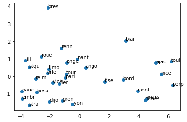
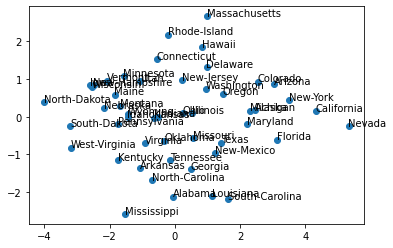
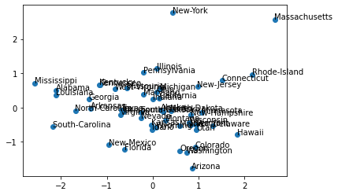
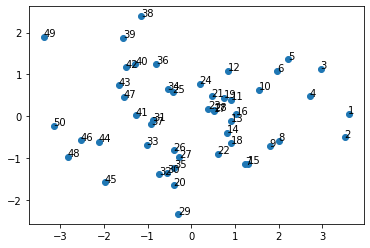
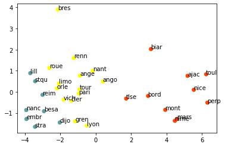
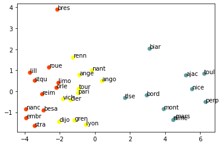
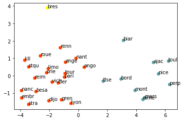
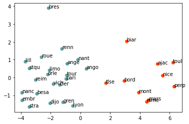

## Johanna GALVIS RODRIGUEZ


```python
import numpy as np
import pandas as pd
import warnings
import matplotlib.pyplot as plt
np.set_printoptions(threshold= 10000,suppress=True)
warnings.filterwarnings('ignore')
```


```python
# réduction de dimensions
villes = pd.read_csv("villes.csv", sep=";", header=0)
X = villes.iloc[:,1:].values # la matrice des temperatures
labels = villes.iloc[:,0].values # les etiquettes: noms des villes
X.shape
```


    (32, 12)


```python
labels
```


    array(['ajac', 'ange', 'ango', 'besa', 'biar', 'bord', 'bres', 'cler',
           'dijo', 'embr', 'gren', 'lill', 'limo', 'lyon', 'mars', 'mont',
           'nanc', 'nant', 'nice', 'nime', 'orle', 'pari', 'perp', 'reim',
           'renn', 'roue', 'stqu', 'stra', 'toul', 'tlse', 'tour', 'vich'],
          dtype=object)


```python
from sklearn.preprocessing import StandardScaler
from sklearn.decomposition import PCA
```


```python
# toutes les variables doivent être centrées-reduites (standardscaler)
# instacier l'objet SC (pour "scaler")
SC = StandardScaler()
SC.fit(X) # séparer fit et transform est conseillé si données dynamiqu
Xnorm = SC.transform(X)
```

### ACP
L'analyse en composantes principales, méthode de réduction de dimensionalité, permet d'obtenir des nouvelles variables, qui sont les **combinaisons linéaires** des variables initiales. Ces  doivent capturer le plus d'information possible, tout en êtant indépendantes entre elles. Nous allons utiliser la version normée, qui est la plus fréquente.


```python
pca=PCA(n_components=12)
pca.fit(Xnorm)
```


    PCA(n_components=12)


```python
pca.explained_variance_
```


    array([10.80999558,  1.45184229,  0.0581652 ,  0.03279996,  0.01406283,
            0.00621041,  0.00523837,  0.00406512,  0.00187861,  0.00145726,
            0.0010361 ,  0.00034505])


```python
pca.explained_variance_ratio_  
#ici on voit la variance de toutes les axes, 
# il est évident q les 2 premiers axes gardent presque toute  l'info
```


    array([0.87268193, 0.11720602, 0.00469563, 0.00264791, 0.00113528,
           0.00050136, 0.00042289, 0.00032817, 0.00015166, 0.00011764,
           0.00008364, 0.00002786])


##### differentes façons de faire pour la séléction des valeurs propres à garder: 
1. à l'étape PCA(n_components=12) remplacer 12 par la quantité d'information à garder désirée, par exemple 0.9
2. explained variance >= 1 
3. le critère de coude (avec un **'scree' plot**): on organise dans un histograme, on sarrete avant d avoir le coude.


```python
pca.components_[0,:] #y1
```


    array([0.27151028, 0.28846164, 0.3010811 , 0.30354174, 0.28353089,
           0.27841907, 0.27290295, 0.28757774, 0.30472022, 0.3038548 ,
           0.29242808, 0.2729549 ])


```python
pca.components_[1,:] #y2
```


    array([ 0.39933494,  0.29907184,  0.12943051, -0.11530598, -0.32314291,
           -0.35846763, -0.38879639, -0.3010133 , -0.11231622,  0.12249226,
            0.26269461,  0.38693688])


```python
 1/np.sqrt(12) # seuil 
```


    0.2886751345948129


Pour **intérpreter** ces variables, on regarde les valeures propres des composantes y1 et y2 (ce sont des poids  des variables qui sont sur les axes, i.d. poids de chaque mois pour ce cas en particulier, y1=0.271xjanv,0.288xfev  ...etc), et on les compare en valeur absolut contre le seuil qu'on vient de montrer pour déterminer chaque participation. A la fin, après les organiser sur l'axe selon leur signe + ou -: mai, juin, juillet, aout - \____y2\____ + jan, fev, dec, Il devient évident que la séparation parle de l'écart ETE - HIVER. Ici nous vennons de le faire "à la main" pour y2 (il faut le faire pour y1 aussi) mais avec la méthode `pca.transform` de sklearn nous gagnons du temps pour la projection:


```python
X_pca = pca.transform(Xnorm)
```


```python
plt.scatter(X_pca[:, 0], X_pca[:, 1])
for label, x, y in zip(labels, X_pca[:, 0], X_pca[:, 1]):
    plt.annotate(label, xy=(x, y), xytext=(-0.2, 0.2), textcoords='offset points') 
plt.show()
```


    

    


#### ACP donnees 'crimes'


```python
crimes = pd.read_csv("crimes.csv", sep=";", header=0)
Xcrimes = crimes.iloc[:,1:].values # la matrice  
labelscrimes = crimes.iloc[:,0].values # les etiquettes   
crimes.head(1)#check what are the crimes considered: 7 crimes au total
```


<div>
<style scoped>
    .dataframe tbody tr th:only-of-type {
        vertical-align: middle;
    }

    .dataframe tbody tr th {
        vertical-align: top;
    }

    .dataframe thead th {
        text-align: right;
    }
</style>
<table border="1" class="dataframe">
  <thead>
    <tr style="text-align: right;">
      <th></th>
      <th>Etat</th>
      <th>Meutre</th>
      <th>Rapt</th>
      <th>Vol</th>
      <th>Attaque</th>
      <th>Viol</th>
      <th>Larcin</th>
      <th>Auto_Theft</th>
    </tr>
  </thead>
  <tbody>
    <tr>
      <th>0</th>
      <td>Alabama</td>
      <td>14.2</td>
      <td>25.2</td>
      <td>96.8</td>
      <td>278.3</td>
      <td>1135.5</td>
      <td>1881.9</td>
      <td>280.7</td>
    </tr>
  </tbody>
</table>
</div>


```python
Xcrimes.shape, labelscrimes # 50 états des EEUU

```


    ((50, 7),
     array(['Alabama', 'Alaska', 'Arizona', 'Arkansas', 'California',
            'Colorado', 'Connecticut', 'Delaware', 'Florida', 'Georgia',
            'Hawaii', 'Idaho', 'Illinois', 'Indiana', 'Iowa', 'Kansas',
            'Kentucky', 'Louisiana', 'Maine', 'Maryland', 'Massachusetts',
            'Michigan', 'Minnesota', 'Mississippi', 'Missouri', 'Montana',
            'Nebraska', 'Nevada', 'New-Hampshire', 'New-Jersey', 'New-Mexico',
            'New-York', 'North-Carolina ', 'North-Dakota', 'Ohio', 'Oklahoma',
            'Oregon', 'Pennsylvania', 'Rhode-Island', 'South-Carolina ',
            'South-Dakota', 'Tennessee', 'Texas', 'Utah', 'Vermont',
            'Virginia', 'Washington', 'West-Virginia', 'Wisconsin', 'Wyoming'],
           dtype=object))


```python
def fitsctr(X):    
    SC = StandardScaler()
    SC.fit(X) # séparer fit et transform est conseillé si données dynamique
    Xnorm = SC.transform(X)
    return Xnorm
```


```python
Xnorm_c = fitsctr(Xcrimes)
pca_c = PCA(n_components=7)
pca_c.fit(Xnorm_c)
```


    PCA(n_components=7)


```python
pca_c.explained_variance_ratio_ 
```


    array([0.58785136, 0.17696026, 0.10368809, 0.04520458, 0.03685349,
           0.03171992, 0.01772229])


```python
#les trois premiers axes gardent le plus d'info, les comparer...
for i in range(3):
    print( [i.round(5) for i in pca_c.components_[i,:]])
```

    [0.30028, 0.43176, 0.39688, 0.39665, 0.44016, 0.35736, 0.29518]
    [-0.62917, -0.16944, 0.04225, -0.34353, 0.20334, 0.40232, 0.50242]
    [0.17825, -0.2442, 0.49586, -0.06951, -0.2099, -0.53923, 0.56838]


```python
 1/np.sqrt(7) # ...contre ce seuil 
```


    0.3779644730092272


On pourrait faire visualisation 3D, 
mais difficile sur ce PDF de l'interpreter, alors plots 2 à 2


```python
def plotPCA(pca, Xnorm, labels, ax1=0, ax2=1):
    X_pca = pca.transform(Xnorm)
    plt.scatter(X_pca[:, ax1], X_pca[:, ax2])
    for label, x, y in zip(labels, X_pca[:, ax1], X_pca[:, ax2]):
        plt.annotate(label, xy=(x, y), xytext=(-0.2, 0.2), textcoords='offset points') 
    return plt.show()
    
```


```python
plotPCA(pca_c, Xnorm_c,labelscrimes, 0, 1)  # axes 1 et 2
```


    

    


```python
plotPCA(pca_c, Xnorm_c,labelscrimes, 1, 2) #axes **2 et 3**
```


    

    


NewYork et Massachussets ont plus de criminalité que Mississippi ou South-Carolina. Plus les valeurs des axes sont positifs la criminalité est plus grande. En regardant de plus près les valeurs des composantes:
- Sur l'axe 1 on arrive à distinguer que les Etats tous ayant des fortes fréquences de rapt, vol, attaqu, viol.
- On s'apperçoit que les Etats où le meurtre est très infréquent, les vol de voitures sont très nombreuses, le nombre de meurtres est très faible (**axe2**) ou le nombre de larcin est très faible (**axe3**).
Cette **deuxième observation** est intéressante, donc  "les Carolinas",Kentucky, Mississippi ont **beaucoup de vols de voitures mais très peu d'assasinats**. C'est plûtot 'calme' on dirait.


```python
# highlights "à la main" pour interprétation (le paragraphe antérieur) :
#meutre     rapt      vol      attaq      v    larcin    auto_theft

#[-------, 0.43176*, 0.39688, 0.39665, 0.44016*, ---------, ------]
#[-0.62917**, -----, -------, ---------, -------, 0.40232, 0.50242**]
#[-------, ------, 0.49586,---------, --------, -0.53923**, 0.56838**]
```

#### ACP donnees '50 Startups'


```python
startup = pd.read_csv("50_Startups.csv", sep=";", header=0)
Xsu = startup.iloc[:,1:].values # la matrice  
labelssu = startup.iloc[:,0].values # les etiquettes   
startup.head(1) #4 types d'investissement : R&D Admin Marketing Benefical
```


<div>
<style scoped>
    .dataframe tbody tr th:only-of-type {
        vertical-align: middle;
    }

    .dataframe tbody tr th {
        vertical-align: top;
    }

    .dataframe thead th {
        text-align: right;
    }
</style>
<table border="1" class="dataframe">
  <thead>
    <tr style="text-align: right;">
      <th></th>
      <th>Id</th>
      <th>Depenses R&amp;D</th>
      <th>Depenses Administration</th>
      <th>Depenses Marketing Spend</th>
      <th>Benefice</th>
    </tr>
  </thead>
  <tbody>
    <tr>
      <th>0</th>
      <td>1</td>
      <td>165349.2</td>
      <td>136897.8</td>
      <td>471784.1</td>
      <td>192261.83</td>
    </tr>
  </tbody>
</table>
</div>


```python
Xsu.shape, labelssu
```


    ((50, 4),
     array([ 1,  2,  3,  4,  5,  6,  7,  8,  9, 10, 11, 12, 13, 14, 15, 16, 17,
            18, 19, 20, 21, 22, 23, 24, 25, 26, 27, 28, 29, 30, 31, 32, 33, 34,
            35, 36, 37, 38, 39, 40, 41, 42, 43, 44, 45, 46, 47, 48, 49, 50]))


```python
Xnorm_s = fitsctr(Xsu)
pca_s = PCA(n_components=4)
pca_s.fit(Xnorm_s)
pca_s.explained_variance_ratio_  
```


    array([0.66804393, 0.25484695, 0.07063561, 0.00647351])


```python
pca_s.components_[0,:]
```


    array([0.59347855, 0.14737886, 0.52064694, 0.59580992])


```python
pca_s.components_[1,:]  # poids négatif tres forte pour R&D
```


    array([-0.04048087, -0.95051314,  0.30797098,  0.00632069])


```python
pca_s.components_[2,:] # interessant ici poids marketing
```


    array([-0.39681837,  0.2723039 ,  0.79581463, -0.36751167])


```python
1/np.sqrt(4)
```


    0.5


```python
plotPCA(pca_s, Xnorm_s,labelssu, 0, 1)
```


    

    


Chaque point est une start_up. A nouveau on voit que 3 axes capturent les variances les plus importantes, les valeurs les plus fortes positifs indiquent fortes dépenses , les negatifs faibles dépenses, et aussi le type de start_up (info "caché" par les simples chiffres-label des start_up) .  Celles avec grandes investissements en **R&D** font aussi des fortes investissements **Admin et Marketing**, et perçoivent à leur tour des grandes **bénéfices**. En **contrepartie**, que celles qui ne font que investir en Marketing sans d'autres investisssements importants, ou celles qui sont très très faibles en R&D, ne perçoivent pas ces grandes bénéfices.

## CLUSTERING


```python
from sklearn.cluster import KMeans
from sklearn.cluster import AgglomerativeClustering
import matplotlib
```


```python
# avec X_norm qui a été déjà obtenu avant ACP précedant, nouveau ACP
pca2 = PCA(n_components=2)
pca2.fit(Xnorm)
X_pca2 = pca2.transform(Xnorm)
villesKM = KMeans(n_clusters=3,random_state=0).fit(X_pca2)

```


```python
villesKM.labels_
```


    array([1, 2, 2, 0, 1, 1, 2, 2, 0, 0, 2, 0, 2, 2, 1, 1, 0, 2, 1, 1, 2, 2,
           1, 0, 2, 2, 0, 0, 1, 1, 2, 2], dtype=int32)


```python
classes = labels
centers = villesKM.cluster_centers_
centers
```


    array([[-3.29443245, -0.61378193],
           [ 4.40157364, -0.07949051],
           [-1.26144834,  0.40751146]])


```python
colors = ['cadetblue', 'orangered', 'yellow']
plt.scatter(X_pca2[:, 0], X_pca2[:, 1], c=villesKM.labels_, cmap=matplotlib.colors.ListedColormap(colors))
for label, x, y in zip(labels, X_pca2[:, 0], X_pca2[:, 1]):
    plt.annotate(label, xy=(x, y), xytext=(-0.2, 0.2), textcoords='offset points')
plt.show()
```


    

    


### Agglomerative Clustering


```python
# méthode 'ward'
villes_aggloW = AgglomerativeClustering(n_clusters=3, linkage="ward")
villes_aggloW.fit(Xnorm)
plt.scatter(X_pca2[:, 0], X_pca2[:, 1], c=villes_aggloW.labels_, cmap=matplotlib.colors.ListedColormap(colors))

for label, x, y in zip(labels, X_pca2[:, 0], X_pca2[:, 1]):
    plt.annotate(label, xy=(x, y), xytext=(-0.2, 0.2), textcoords='offset points')
plt.show()
#note: affinity employé pour les deux méthodes 'euclidean' (default)
```


    

    


```python
# méthode 'average'
```


```python
villes_aggloA = AgglomerativeClustering(n_clusters=3, linkage="average")
villes_aggloA.fit(Xnorm)
plt.scatter(X_pca2[:, 0], X_pca2[:, 1], c=villes_aggloA.labels_, cmap=matplotlib.colors.ListedColormap(colors))

for label, x, y in zip(labels, X_pca2[:, 0], X_pca2[:, 1]):
    plt.annotate(label, xy=(x, y), xytext=(-0.2, 0.2), textcoords='offset points')
plt.show()
```


    

    


On peut voir avec 'ward'(premier plot de cette section) que les clusters formés divisent en régions très froides (bleue), temperées (jaune), ou chaudes (orangered). 
En contrapositon, la méthode 'average' (ci-haut) met Brest dans un cluster unique, le reste étant divisés entre froid ou chaud. La **méthode à privilégier** dépende de la connaissance sur les données et des proprietés des algorithmes derrière. L'Aggrégation en générale part d'un nombre importante de petits clusters qui sont combinés en étapes succèsives de façon **hiérarchique** jusqu'à convergence. Pour 'ward' le but est de minimiser la variance intra-cluster formé, alors la tendance sera de former des clusters pas trop étendus. Pour 'average' c'est la moyenne des distances de chaque individu au **barycentre** de son cluster et celui du cluster voisin, alors plus de clusters peuvent être générés.


```python
# DETERMINER LA MEILLEURE PARTITION: KMeans, metrics, silhouette_score
```


```python
from sklearn import metrics
```


```python
for i in np.arange(2, 6):
    clu_i = KMeans(n_clusters=i).fit_predict(Xnorm)
    score = metrics.silhouette_score(Xnorm,clu_i)
    print(score)

```

    0.625557719180767
    0.38809425947195864
    0.39249385306689233
    0.314305306703394


Le **silhouete score** le plus élévé (0.625) est obtenu quand on utilise 2 partitions, donc 2 clusters est l'option à privilegier au moment d'appliquer l'algorithme KMeans sur ce jeux de données.


```python
""" LE MEILLEUR CLUSTERING via KMeans """
NEWNB =2
villesKM = KMeans(n_clusters=NEWNB,random_state=0).fit(X_pca2)
centers = villesKM.cluster_centers_

colors = ['cadetblue', 'orangered']
plt.scatter(X_pca2[:, 0], X_pca2[:, 1], c=villesKM.labels_, cmap=matplotlib.colors.ListedColormap(colors))
for label, x, y in zip(labels, X_pca2[:, 0], X_pca2[:, 1]):
    plt.annotate(label, xy=(x, y), xytext=(-0.2, 0.2), textcoords='offset points')
plt.show()
```


    

    


```python
# END. by:johanna 
```
